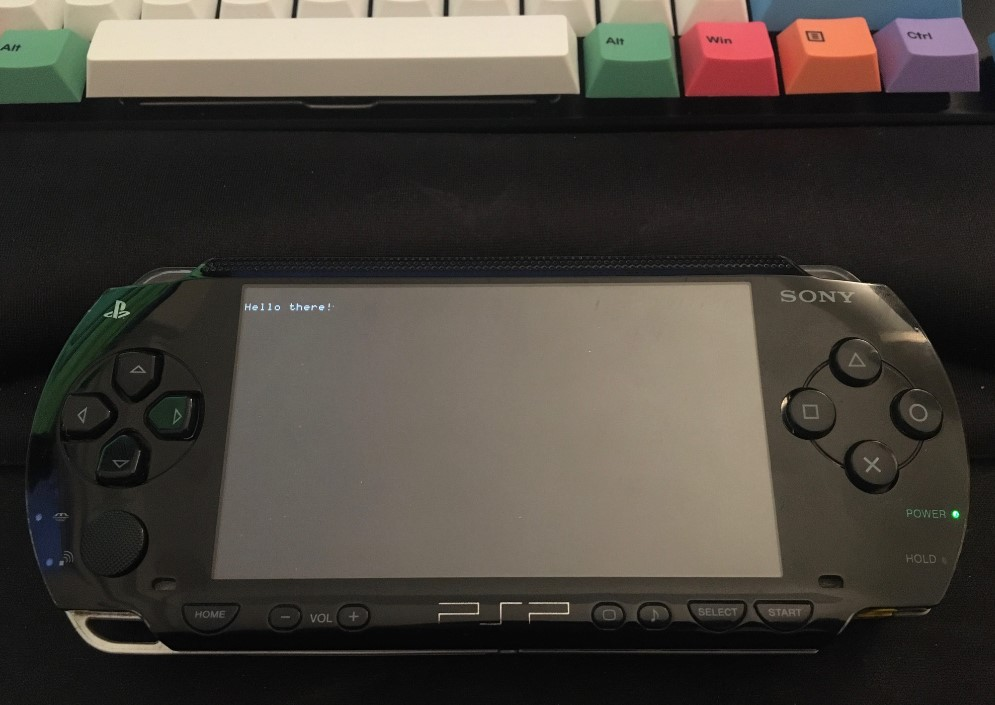

## hello-world-psp

A hello world like app for the Sony Playstation Portable handheld videogame system (PSP).

## Prerequisites

- You will need to setup `pspdev` toolchain - more about it [here](https://psp-dev.org/doku.php?id=tutorial:toolchain_setup).
- Easy `docker` alternative (the one used for this repo): use [pspdev-docker](https://github.com/pspdev/pspdev-docker)
```
git clone git@github.com:pspdev/pspdev-docker.git

docker build -t pspdev-docker .

sudo cp pspdev-docker /usr/local/bin
```
> Note: `docker build` took me around 25 mins on an Intel i7-6700K cpu.

## How to build
- Clone this repo and `cd` into the repo folder.
- If you used the `docker` alternative, run:
```
psp-docker make
```

You should see an output similar to:
```
psp-gcc -I. -I/usr/local/pspdev/psp/sdk/include  -D_PSP_FW_VERSION=500   -c -o main.o main.c
psp-gcc -I. -I/usr/local/pspdev/psp/sdk/include  -D_PSP_FW_VERSION=500  -L. -L/usr/local/pspdev/psp/sdk/lib -specs=/usr/local/pspdev/psp/sdk/lib/prxspecs -Wl,-q,-T/usr/local/pspdev/psp/sdk/lib/linkfile.prx   main.o /usr/local/pspdev/psp/sdk/lib/prxexports.o  -lpspdebug -lpspdisplay -lpspge -lpspctrl -lpspsdk -lc -lpspnet -lpspnet_inet -lpspnet_apctl -lpspnet_resolver -lpsputility -lpspuser -lpspkernel -o Tutorial.elf
psp-fixup-imports Tutorial.elf
psp-prxgen Tutorial.elf Tutorial.prx
pack-pbp EBOOT.PBP PARAM.SFO NULL  \
        NULL NULL NULL  \
        NULL  Tutorial.prx NULL
[0]        316 bytes | PARAM.SFO
[1]          0 bytes | NULL
[2]          0 bytes | NULL
[3]          0 bytes | NULL
[4]          0 bytes | NULL
[5]          0 bytes | NULL
[6]      86842 bytes | Tutorial.prx
[7]          0 bytes | NULL
```

## How to run

- You can either run it on an emulator like [`PPSSPP`](http://ppsspp.org/downloads.html)
- If your PSP is modded to run homebrew software (e.g. runs on Custom Firmware), you can copy paste the `EBOOT.PBP` file to your PSP memory card, following a path like: `PSP/GAME/<some-name-of-your-choice>/EBOOT.PBP`

End result should look similar to this:



## Resources

- [hello world on psp-dev.org](https://psp-dev.org/doku.php?id=tutorial:hello_world)
- [psp dev forums c programming tutorials](http://forums.qj.net/psp-development-forum/158366-tut-beginner-c-programming-tutorials.html)
- [pspdev github page](https://github.com/pspdev)